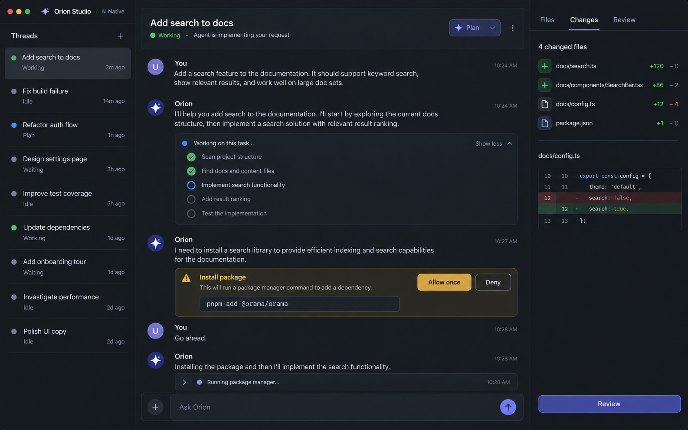

# v1.17.0 AI Native Conversation-First Workspace 开发计划

> 状态：APPROVED / REVISION 3 / READY FOR IMPLEMENTATION
>
> 基线：Orion Studio `main`，应用版本 `1.16.3`
>
> 版本目标：`1.17.0`
>
> 本文替代此前“底部 Agent Panel 为主”的 v1.17.0 草案。AI 交互记录必须成为中央主内容。
>
> ### REVISION 3 变更说明（2026-09-12）
>
> R2 把「单一数据源」与「单一渲染表现」混为一谈。§3.2 禁止触碰 `ConversationView`、§4.1 要求中心 item 原样复用 dock 视图，结果是**一个为约 300px dock 设计的视图被直接搬进中央舞台**：`crates/agent_ui/src/conversation_view.rs` 全文 11,230 行，**没有任何阅读列宽约束**（`max_w(` 出现 0 次），也**不存在任何渲染位置感知分支**（`is_center` / `in_center` / `center_surface` / `AiNative` 均无匹配）。
>
> 后果有三：中央对话区只有 dock 的视觉契约，消息横跨整个中央区、工具过程仍是侧栏式折叠行、权限审批仍是行内小按钮，与 §2 概念图确立的信息架构和状态密度不符；任务身份只能由中心 item 在外层另行拼装 header，而非由对话区自身承载；同一个 view 被迫承担两种互斥的展示职责，架构上留了脏点。
>
> R3 明确：**不复制状态**（§4.1 原则不变），但**必须区分渲染表现**。新增 §4.6 定义 `ConversationSurface { Dock, Center }` 渲染模式与中央视觉契约，并同步纳入 §6 Phase 1、§7 自动化测试与 §8 真机验收。R3 仍然不重写 `ConversationView` 的数据与状态模型。

## 1. 产品目标

新增第三种可切换布局 **AI Native**。它不是“代码编辑器加一个聊天面板”，而是一个以任务线程和 AI 对话为第一入口的 Workspace：用户打开 AI Native 后，首先看到的是当前任务的完整 AI 交互记录，而不是源代码编辑器。

默认信息架构：

| 区域 | 默认内容 | 职责 |
| --- | --- | --- |
| 左侧 | Threads Sidebar | 浏览、切换、创建和感知任务状态 |
| 中央 | AI Conversation Surface | 当前任务的对话、计划、工具过程、审批、提问、结果与 Composer |
| 右侧 | Task Inspector | 固定的 Changes、Files、Review tab 与当前任务的代码证据 |
| 代码编辑器 | 按需打开的普通 Workspace item | 深入阅读/编辑文件后可随时返回 AI Conversation Surface |

AI Native 参考 Codex 的任务流层级：线程列表在左、连续会话记录在中、变更和上下文在右。Orion Studio 的编辑器、项目模型、ACP 和主题系统继续保留；本版不复制 Codex 的品牌、图标、字体、资产或桌面端像素细节。

## 2. 概念效果图与视觉契约



> 此图是信息架构和状态密度的验收基线，不是应用内 raster 资产。实现必须由 GPUI 组件与现有 Orion Studio theme token 完成。此前的底部对话概念图保留为历史草图，不再参与本版验收。

### 2.1 必须成立的视觉关系

- **中央必须是对话记录。** 中央区约占可用宽度的三分之二，显示任务标题、运行状态、用户消息、agent 回复、工具进度、审批/问题和固定 Composer。这里不得出现代码编辑器、行号、文件 tab 或底部 dock。
- **左侧是任务轨道。** 每个线程仅显示标题、状态、近期活动和必要提醒。选中线程立刻驱动中央对话切换，而不是只改变一个隐藏的 Agent Panel。
- **右侧是任务检查器。** 固定的 Changes、Files、Review tab 只呈现当前任务相关的代码证据；点击文件才进入普通代码 item，不能在默认态取代中央对话。
- **对话的 Composer 固定在中央底部。** 它属于中央 Conversation Surface，不能作为独立底部 panel 出现。
- **状态比装饰重要。** Running、Waiting、Queued、Needs permission、Needs answer、Review available 必须有文本、图标和可达操作，颜色只作辅助。

### 2.2 尺寸、密度与主题规则

| 项目 | 目标 | 实现约束 |
| --- | --- | --- |
| 左 / 中 / 右比例 | 约 16% / 66% / 18% | 仅为默认视觉目标；现有可拖拽 dock 尺寸仍由用户控制，不新增全局固定像素值 |
| 中央 header | 单行任务标题、状态、agent、可用 mode 与更多菜单 | 不使用普通编辑器 tab bar 代替任务 header |
| 对话时间线 | 可滚动、消息段落有清晰作者与时间顺序、工具过程可折叠 | 继续复用 `ConversationView`、`ThreadView` 和现有虚拟化/滚动机制 |
| Composer | 固定于中央底部，上方显示队列与待处理状态 | 不复制 queue、permission 或 elicitation 状态机 |
| 右侧检查器 | Changes / Files / Review 为同一紧凑 tab strip，默认 Changes | 不嵌套完整 ProjectPanel、GitPanel 或 OutlinePanel；各 tab 共享当前任务与右 dock 的单一焦点 |
| 代码回退 | 打开文件后显示现有 code item 与标准 tab bar | 回到 AI Native 时重新激活中心会话 item；不丢弃打开的文件 |
| 主题 | 完全使用 Orion Studio 语义 token、图标和焦点样式 | 不写死 Codex 调色板、字体或图标；浅色主题也必须可读 |

### 2.3 状态规格

| 状态 | 左侧 Threads | 中央 Conversation Surface | 右侧 Inspector |
| --- | --- | --- | --- |
| Idle | 中性状态，当前线程选中 | Composer 可输入，展示可用配置 | 最近文件与上次变更 |
| Generating | Running 指示，不闪烁整行 | 流式回答和工具进度；可准备后续消息 | 根据现有变更刷新 |
| Queued | 待办计数 | Composer 上方显示队列数量和首项入口 | 不抢占焦点 |
| Needs permission | 明确警告/待办 | 当前工具条目呈现 agent 实际给出的允许/拒绝选项 | 可显示受影响文件，但不代替审批 |
| Needs answer | 待回答标识 | 内嵌 form/URL elicitation | 保持当前上下文 |
| Review available | 变更可审查标识 | 可跳转到 Agent Diff | Changes/Review 显示文件和 diff |
| Terminal thread | 终端线程类型标识 | 中央临时显示该线程的 Terminal Surface | 保持任务相关文件；切回 agent 线程时恢复对话 |

### 2.4 可交互 UI 效果指引（`evidence/v1.17.0.html`）

`docs/plan/evidence/v1.17.0.html` 是本计划的**可交互效果指引**，与 §2 概念图同源但可操作。实现与验收时两者并用：

- **概念图**（`evidence/v1.17.0-ai-native-conversation-first-concept-v2.png`）：信息架构与状态密度的**验收基线**。
- **交互稿**（`evidence/v1.17.0.html`）：布局契约的**可验证形式**，浏览器直接打开，无需构建。

交互稿顶部有一条「验收对照（非产品 UI）」工具条，把 §4.6.2 与 §7 的断言变成可上手的操作：

| 控件 | 验证内容 |
| --- | --- |
| Center / Dock 模式切换 | 修订前后的直接对照：Dock 铺满容器，Center 走居中阅读列 |
| 窗口宽度滑杆（900–1800px） | 拖动即可证明阅读列**不随窗口变宽而拉伸** |
| 实时读数与判定 | 实测「中央区 / 阅读列」宽度，并输出「满足契约：有上限的居中列」或「铺满容器 — 不满足契约」 |
| 显示列宽参考线 | 叠加阅读列边界 |
| 无活动线程 | 切换到 §4.4 要求的空状态 |

使用约束：

- 交互稿是**设计指引，不是应用内资产**，不得作为 raster 资源打包；实现必须由 GPUI 组件与现有 theme token 完成。
- 交互稿中的具体数值（阅读列宽、圆角、间距）仅为示意，**以 §4.6.2 与 `crates/ui` 的既有 token 为准**。
- 交互稿配色沿用概念图的暗色 + 紫色强调。这是**刻意选择**：概念图是验收基线，优先于通用设计规范中的配色偏好。
- 交互稿与概念图或 §4.6.2 文字契约不一致时，**以概念图与文字契约为准**，并应回头修正交互稿。

## 3. 已确认的范围与边界

### 3.1 本版包含

- 新增 Classic、Agentic 之外的 AI Native Conversation-First 预设。
- 新增可放入中央 Pane 的单例 `AiNativeConversationItem`，承载当前 agent 对话或 terminal surface。
- 将线程切换与 Agent Panel 的活动视图同步到中央 item。
- 在 AI Native 激活期间，让中央对话 surface 取代 dock 内的 Agent Panel 渲染，而不是复制同一个 `ConversationView`。
- 保留并重新组织现有消息队列、模式、配置、工具审批、结构化提问、上下文和变更审查。
- 仅使用当前 ACP 公开能力；更新用户文档、版本号和验收记录。

### 3.2 本版不包含

- 修改 Orion Code、sidecar 安装、ACP wire protocol 或 agent runtime。
- 新建 Codex 专属的目标预算、全局 Agent Dashboard、通用子 agent 调度或私有 session 字段。
- 重写 `ConversationView` / `ThreadView` 的数据与状态模型：session、message queue、permission、elicitation、Agent Diff 与项目文件模型的控制流一律沿用现有实现。
- **例外（R3 新增）**：为 `ConversationView` 引入按渲染位置区分的 surface 模式分支属于本版范围，见 §4.6。该分支只影响布局与呈现，**不持有任何新状态、不新增第二条会话、不改动 ACP 调用**。它不构成“重写 ConversationView”。
- 移除普通代码编辑器、阻止用户打开文件、强制关闭现有代码 tab 或改变用户 dock 尺寸。
- 自动创建外部 agent/线程、自动认证，或把当前用户的 Classic/Agentic/Custom 状态强制迁移为 AI Native。

## 4. 架构设计

### 4.1 单一会话 surface 原则

`AgentPanel` 当前拥有 agent/terminal 生命周期、活动 `ConversationView`、恢复状态、队列和大量既有 action。v1.17.0 不复制这些状态，也不创建第二条会话。

- `AgentPanel` 继续作为**生命周期宿主**：创建/恢复线程、保存当前活动视图、处理 agent action、维护 terminal 和 retained threads。
- 新建逻辑组件 `AiNativeConversationItem`，实现 Workspace `Item`、`Focusable` 和事件订阅；它引用 AgentPanel 当前活动 surface，而不重新创建 `ConversationView` 或 ACP session。
- AI Native 中，中心 item 是该 `ConversationView` 的**唯一可见渲染位置**。AgentPanel 的 dock 保持关闭；若用户触发旧的 Agent Panel 聚焦入口，则路由到中心会话 item，不能同时渲染两个对话表面。
- `AgentPanelEvent::ActiveViewChanged`、线程选择、恢复完成和 terminal/agent 视图切换会更新中心 item。中心 item 不拥有会话持久化权，也不得直接改写 AgentPanel 的 thread map。
- 关闭中心 item、切换到 Classic/Agentic 或关闭 Workspace 时，订阅必须释放；会话仍由 AgentPanel 正常保存和恢复。重新进入 AI Native 时只重新绑定当前活动 surface。
- **单一数据源 ≠ 单一渲染表现（R3 明确）**。中心 item 渲染活动 surface 时必须传入 `ConversationSurface::Center`，dock 内的 AgentPanel 渲染时传入 `ConversationSurface::Dock`；`ConversationView` 依该模式选择布局契约（§4.6）。该模式为只读入参：不写入设置、不进入 thread 持久化、不改变任何会话控制流，也不构成第二条会话。
- 因此，**上一版在中心 item 外层拼装的任务 header 属于过渡实现**：R3 要求任务身份由中央对话区自身在 `Center` 模式下渲染（§4.6），外层不再叠加第二个 header。

### 4.2 中央 Pane 行为

- AI Native action 在当前中心 Pane 中查找或创建每个 Workspace 唯一的 `AiNativeConversationItem`，激活并聚焦它。
- 中心 item 激活时，Pane 的 tab bar 通过已有 `set_should_display_tab_bar` 扩展点隐藏；用户打开普通代码 item 后恢复标准 tab bar。这样默认画面保持对话优先，而不破坏普通编辑器工作流。
- `FocusAiNativeConversation` action 从任何代码 item 返回当前中心会话；该 action 在 Command Palette 可发现，但本版不新增可能冲突的默认快捷键。
- 点击右侧 Files/Changes/Review 中的文件按现有行为打开普通代码 item。任务 header 中提供“返回任务”入口，返回时不清空代码 tab、选择、滚动位置或未保存修改。
- 当前 AgentPanel surface 为 terminal 时，中心 item 临时承载相同 terminal view 并显示 terminal 线程身份；切换回 agent 线程后恢复 ConversationView。Terminal 不被伪装成聊天记录。

### 4.3 布局与持久化

在 `crates/agent_settings/src/agent_settings.rs` 扩展预设模型：

- 新增 `WindowLayout::AiNative` 和唯一 `PanelLayout::AI_NATIVE`：`agent_dock = Bottom`、Project/Outline/Collaboration/Git 均在 Right。Agent dock 仅作为生命周期宿主的既有位置，在 AI Native 中保持关闭，不占可视空间。
- 将 AI Native 加入识别、写入差异和 Custom 恢复逻辑；保留当前五个 dock 字段作为布局识别事实源。
- 显式选择 AI Native 时，在一次 settings 写入中应用 AI Native dock 组合并将 `agent.sidebar_side` 设为 left。Sidebar 方向不参与 Classic/Agentic/Custom 的等值识别，避免旧设置误判。
- 不写入 `default_width`、`default_height` 或现有面板大小；不改变全局默认启动布局；用户手动改变 dock 后按现有规则进入 Custom。
- 进入 AI Native 时关闭可见 AgentPanel dock 并展示中心 item；离开 AI Native 时仅卸载中心 item/恢复普通 item 展示，不擅自清理用户打开的文件或持久偏好。

### 4.4 入口与 action 路由

在 `crates/title_bar/src/title_bar.rs` 和相关 Workspace action 注册处：

- 新增 `workspace::UseAiNativeLayout`、`workspace::FocusAiNativeConversation`。
- 在 User Menu 的 Panel Layout 子菜单显示 Classic、Agentic、AI Native、Custom；AI Native 有正确选中态。
- Command Palette 的 AI layout filter 与 `disable_ai` 一并更新；AI 被禁用时，AI Native 的切换和聚焦 action 均不可见。
- `UseAiNativeLayout` 顺序固定为：写入预设 -> 打开左侧 Threads -> 绑定/激活中心 item -> 关闭可见 AgentPanel dock -> 聚焦当前 Composer。无活动线程时显示中心新建线程入口，但不启动 agent。
- `NewThread`、`OpenAgentDiff`、添加上下文、权限操作等既有 action 继续通过 AgentPanel 处理；AI Native 只改变最终聚焦目标和渲染位置。

### 4.5 右侧 Task Inspector

右侧不是现有 Project、Git、Outline 三个完整 panel 的堆叠，而是新的单一 `TaskInspectorPanel`。它固定停靠右侧，在 AI Native 中作为唯一默认打开的右 dock surface，采用类 Codex 的低层级 tab strip：`Changes`、`Files`、`Review`。当前 tab 仅作为 Workspace 级 UI 状态保存；不把 tab 选择写入全局布局设置。

| Tab | 默认可见内容 | 可复用内容 | 本版实现决定 |
| --- | --- | --- | --- |
| Changes | 当前任务影响的文件清单、A/M/D 状态、增删行摘要、选中文件的紧凑 diff preview | Git repository/worktree 状态、现有 changed-file 行、文件打开 action | 新建紧凑 `TaskChangesView`；不嵌入完整 `GitPanel`，不显示 commit 表单、历史或仓库级设置 |
| Files | 当前项目工作树的紧凑文件树、最近由 agent 读取/修改的文件优先提示 | Project/worktree 模型、文件树条目、图标、筛选和打开文件 action | 新建 `TaskFilesView` 或从 ProjectPanel 提取可嵌入树列表；不复制 ProjectPanel 的独立 dock、标题栏和设置菜单 |
| Review | 当前 agent thread 可审查变更数、文件/块摘要、进入完整审查的入口 | `AgentDiff` 的 thread 变更追踪、hunk 状态、接受/拒绝 action | 右侧只做摘要与单文件 preview；点击“打开完整审查”后使用现有 `AgentDiffPane` 作为显式中心 Review item，并提供“返回任务” |

以下现有能力不进入右侧默认 tab：

- `OutlinePanel`：只在用户打开普通代码 item 后作为可选工具入口，不能挤占 Files/Changes/Review 的默认位置。
- 完整 `GitPanel`：保留为仓库级提交、历史和高级 Git 操作的独立 panel；Task Inspector 只消费其项目/变更事实源，不复制完整流程。
- Terminal、工具输出、权限与结构化问题：属于当前任务的因果时间线，必须继续留在中央 Conversation Surface。
- Collaboration panel：不属于单个 agent 任务的代码证据，保持现有独立入口。

实现必须先抽取最小、只读或 action 驱动的共享视图模型，再在 Task Inspector 中组合；不得通过渲染同一个 ProjectPanel、GitPanel 或 AgentDiffPane 实体两次来“复用”。右侧 preview 的接受/拒绝动作仍调用现有 `AgentDiff` 逻辑，并以 thread id 过滤，不能误操作其他任务或用户未关联的工作树变更。

### 4.6 中央对话区的 Center 渲染模式（R3 新增）

R2 的中央对话区直接复用了 dock 的视觉契约，因此与 §2 概念图确立的信息架构和状态密度不符。本节定义唯一允许的表现差异来源：`ConversationSurface`。

#### 4.6.1 模式定义

```rust
/// 由渲染位置决定。只读入参，不写入设置、不进入 thread 持久化。
pub enum ConversationSurface {
    Dock,
    Center,
}
```

- `AgentPanel` 在 dock 内渲染现有 view 时传 `Dock`，行为与 v1.16 完全一致——**零回归是硬约束**。
- `AiNativeConversationItem` 在中心 Pane 渲染时传 `Center`。
- 模式只影响 `render` 路径中的布局与呈现；**不得据此分支任何状态、订阅、action 路由或 ACP 调用**。

#### 4.6.2 中央视觉契约

`Center` 模式下必须成立以下关系（对应 §2.1 与概念图）：

| 维度 | Dock（现状，不得改变） | Center（本版必须达到） |
| --- | --- | --- |
| 内容列宽 | 铺满容器 | 正文与工具卡片约束在约 720–820px 的**居中阅读列**内；Composer 对齐同一列宽 |
| 消息分块 | 紧凑行 | 用户与 agent 消息为独立分块，含作者标识与时间顺序；块间距显著大于 dock |
| 任务身份 | 无（由 dock 标题承担） | 对话区顶部渲染任务 header：单行任务标题、状态、agent、可用 mode 与更多菜单；**不得再由中心 item 外层叠加第二个 header** |
| 工具过程 | 折叠行 | 连续工具调用聚合为**可折叠任务卡片**，含卡片标题、进度、逐项状态与 Show less / Show more；卡片是时间线的一等元素 |
| 权限审批 | 行内小按钮 | **独立审批卡片**：警告条 + 操作摘要 + 命令/路径块 + agent 实际给出的允许/拒绝选项，action 绑定保持不变 |
| 结构化提问 | 行内表单 | 内嵌 form / URL 卡片，与审批卡片同级 |
| 密度与排版 | 侧栏密度 | 字号、行距与内边距按中央舞台放宽；完全使用现有 theme token 与焦点样式，浅色主题同样可读 |
| Composer | 侧栏底部 | 固定于中央底部并**对齐阅读列**；上方显示队列与待办状态 |

不得为实现上述差异而新增第二份消息数据、第二套滚动状态或第二个 `ConversationView` 实体。

#### 4.6.3 边界

- 中央模式下**不得出现**普通编辑器 tab bar、行号或文件 tab；已有 `set_should_display_tab_bar` 扩展点继续负责。
- 消息虚拟化、滚动、搜索、折叠选中与 compaction 在两种模式下共用同一套实现，仅参数与样式不同。
- 工具卡片折叠状态、滚动位置与 Composer 草稿在模式切换（AI Native ⇄ Classic/Agentic）之间不丢失，也不写入全局设置。
- 阅读列宽的具体数值是实现细节，但必须是一个**有上限的居中列**；“铺满容器”不满足契约。

### 4.7 组件复用映射（R3 新增）

§4.6.2 的契约行项**几乎全部已有现成实现**。本版的主要工作量在**布局与密度层**，而不是新建组件。实现时必须先复用下表左列对应的现有实现；仅当某行项确实不存在时才新建，并在提交信息中写明原因。

#### 4.7.1 对话区（`crates/agent_ui/src/`）

| §4.6.2 行项 | 现有实现 |
| --- | --- |
| 时间线虚拟化与条目分派 | `conversation_view/thread_view.rs`：`render_entries`、`render_entry` |
| 任务身份与活动状态 | `thread_view.rs`：`render_activity_bar`、`render_subagent_titlebar`、`render_thread_controls` |
| 生成中 / 思考块 | `thread_view.rs`：`render_generating`、`render_thinking_block` |
| **任务卡片（计划与进度）** | `thread_view.rs`：**`render_plan_summary`、`render_plan_entries`、`render_completed_plan`** —— 与概念图「Working on this task…」卡片同构 |
| 工具调用卡片 | `thread_view.rs`：`render_tool_call`、`render_any_tool_call`、`render_tool_call_label`、`render_collapsible_command` |
| 工具输出（按类型） | `thread_view.rs`：`render_markdown_output`、`render_numbered_read_file_output`、`render_image_output`、`render_embedded_resource_output`、`render_resource_link` |
| **权限审批卡片** | `thread_view.rs`：**`render_main_agent_awaiting_permission`、`render_permission_buttons`、`render_permission_buttons_flat`、`render_permission_buttons_with_dropdown`、`render_sandbox_authorization_details`、`render_sandbox_authorization_path_row`、`render_sandbox_confusable_warning`**；配套 `ui/sandbox_status_tooltip.rs` |
| **结构化提问卡片** | `thread_view.rs`：`render_elicitation`、`render_request_elicitations`；`conversation_view/elicitation.rs`（76 KB / 12 个 render 函数） |
| **Composer** | `thread_view.rs`：**`render_message_editor`、`render_send_button`、`render_add_context_button`**、`render_follow_toggle`；配套 `message_editor.rs`、`inline_prompt_editor.rs`、`mention_set.rs` |
| 队列与 steer | `thread_view.rs`：`render_message_queue_summary`、`render_message_queue_entries`、`render_queue_steer_button`；`conversation_view/message_queue.rs` |
| 变更摘要 | `thread_view.rs`：`render_edits_summary`、`render_edited_files`、`render_edited_files_buttons` |
| diff 预览 | `thread_view.rs`：`render_diff_editor`、`render_diff_loading` |
| 子 agent | `thread_view.rs`：`render_subagent_card`、`render_subagent_tool_call`、`render_subagent_expanded_content` |
| 终端工具 | `thread_view.rs`：`render_terminal_tool_call`；`ui/terminal_tool_header.rs` |
| 模型 / 模式 / 推理等级 | `thread_view.rs`：`render_fast_mode_control`、`render_thinking_control`、`render_effort_selector`；`mode_selector.rs`、`model_selector.rs`、`config_options.rs` |
| token 用量 / 沙箱状态 | `thread_view.rs`：`render_token_usage`、`render_sandbox_status` |
| 线程搜索与重试 | `conversation_view/thread_search_bar.rs`、`thread_view.rs`：`render_thread_retry_status_callout` |
| Markdown 渲染 | `thread_view.rs`：`render_markdown`；`conversation_view.rs`：`render_agent_markdown`、`render_cat_numbered_code_block` |
| 错误与提示 | `thread_view.rs`：`render_thread_error`、`render_any_thread_error`、`render_error_callout`、`render_refusal_error` 及各类 Callout |

#### 4.7.2 共享 UI 原语（`crates/ui/src/components/`）

| 用途 | 原语 |
| --- | --- |
| 消息作者头像 | `avatar.rs` |
| 状态胶囊 / 状态点 / 计数 | `chip.rs`、`indicator.rs`、`count_badge.rs` |
| 权限警告条与横幅 | `callout.rs`、`banner.rs` |
| 折叠指示 | `disclosure.rs` |
| 主次按钮（Allow once / Deny / Review） | `button/` |
| 变更统计 `+N −N` | `diff_stat.rs` |
| 进行中指示 | `progress/` |
| 时间线虚拟化与滚动 | `list/`、`sticky_items.rs`、`scrollbar.rs` |
| 右侧三 tab | `tab.rs`、`tab_bar.rs`、`toggle.rs` |
| Files tab 文件树 | `tree_view_item.rs`、`icon/` |
| 悬停提示 | `tooltip.rs` |
| 布局与排版基础件 | `label/`、`divider.rs`、`stack.rs` |
| 左侧线程条目 | `ai/thread_item.rs` |
| 空状态 | `project_empty_state.rs` |

#### 4.7.3 主题 token

`crates/ui/src/styles/`：`color.rs`、`typography.rs`、`spacing.rs`、`elevation.rs`、`severity.rs`、`animation.rs`、`units.rs`。

Center 模式**不得写死**颜色、字号或间距；§4.6.2 的「密度放宽」必须通过既有 token 与 `spacing` / `typography` 表达，并保证浅色主题可读。

#### 4.7.4 既有复用先例

`crates/agent_ui/src/task_inspector.rs` 已经建立在 `ui::` 原语之上（`Divider`、`ToggleButtonGroup`、`ToggleButtonGroupSize`、`ToggleButtonGroupStyle`、`ToggleButtonSimple`、`Tooltip`）。Center 模式必须沿用同一做法，**不得新造并行原语**。

#### 4.7.5 预期需要新建的部分（范围很小）

- `ConversationSurface` 枚举本身与 `render` 分派。
- Center 模式下的**阅读列容器**（居中 + 最大宽度）与密度参数。
- 若现有 `render_plan_*` 无法直接呈现概念图的卡片形态，**仅允许在 Center 模式下包一层卡片外壳**，不得改写其内部逻辑或数据来源。
- 除此之外的任何新建都需要在提交信息中说明「为何现有实现不可复用」。

## 5. 中央对话交互

中央 Conversation Surface 的功能来自现有能力，不通过 UI 伪造 agent 特性：

| 功能 | 呈现位置 | 规则 |
| --- | --- | --- |
| 任务状态 | 中央 header | 显示现有 ThreadStatus、agent 与活动线程标题 |
| Session mode | header | 仅当 ACP `session_modes` 存在时显示并可切换 |
| 模型/推理配置 | header 或 Composer 状态层 | 仅渲染 ACP `config_options` 声明的项；更新失败按原有错误处理回退 |
| 对话和工具过程 | 中央时间线 | 复用现有 streaming、折叠、滚动、搜索和 compaction 行为 |
| 消息队列 | Composer 上方 | 复用现有编辑、移除、立即发送、steer 和自动继续语义 |
| 权限和提问 | 对应时间线条目 + 待办提示 | 使用真实 ACP permission/elicitation 选项；完成后保持当前线程和 Composer 焦点 |
| 变更审查 | header/时间线入口与右侧 Review | 继续使用 Agent Diff 和现有逐段接受/拒绝操作 |
| `@` 上下文和附件 | Composer | 行为、权限和快捷键均保持不变 |

中央 header、工具条目和 Composer 必须使用现有 theme token、键盘焦点和 screen-reader 文本。任何状态都不能只依赖颜色；未经 ACP 声明的 mode、推理等级或 agent 目标状态不得显示空壳控件。

## 6. 开发路径与并行边界

实施前重新核对 branch、HEAD、dirty worktree、版本和本计划。开始修改 source 文件前，严格遵守仓库 `AGENTS.md` 的 README 人工评审标记规则。不得改动本计划以外的既有未跟踪文件。

### 6.0 当前实施状态（2026-09-12 核对，实施前需重新确认）

- 分支 `release/orion-studio-v1.17.0`，产品版本已为 `1.17.0`（`crates/zed/Cargo.toml`）。
- 相对 `main` 有 **8 个提交、6 个文件、423 行**：预设、中心 item、菜单入口、focus action、激活时机、版本号、任务 header、选择 AI Native 崩溃修复。
- **§4.5 Task Inspector 共 2,109 行仍处于未提交/未跟踪状态**：`task_inspector.rs` 749、`task_inspector/changes.rs` 658、`task_inspector/files.rs` 377、`task_inspector/review.rs` 325；另有 12 个文件 / 463 行改动挂在工作区。
- §4.6 的 `ConversationSurface` **尚未开始实现**：`conversation_view.rs` 当前既无阅读列宽约束（`max_w(` 出现 0 次），也无渲染位置分支。
- **实施顺序要求**：先提交固化 §4.5 既有的 2,109 行，再进入 §4.6 的渲染层改动，避免两份改动混入同一 diff。

### Phase 0 — 基线与设计夹具

- 记录当前 Classic/Agentic、AgentPanel、Threads Sidebar 与真实 Dev App 状态。
- 建立/复用 ACP fixture：无 capability、mode/config、permission、elicitation、队列、terminal 各一份。
- 为中心 item 生命周期先写最小失败测试：同一 `ConversationView` 不能在 AgentPanel 和中心 Pane 同时可见。
- **完成条件**：现有行为有可复现基线，中心承载的边界被测试锁定。

### Phase 1 — 会话 surface 抽取

**工作流 A：`agent_ui`，必须先完成。**

- 增加 `AiNativeConversationItem` 及其中心 Pane 生命周期。
- 让 AgentPanel 在 AI Native 中成为隐藏的生命周期宿主，提供活动 surface 和事件订阅点。
- 完成 ConversationView/TerminalView 的中心渲染、焦点转交、订阅释放、关闭与恢复。
- **（R3）引入 `ConversationSurface { Dock, Center }` 并贯通渲染调用链**：`AgentPanel` 传 `Dock`，中心 item 传 `Center`。先用一个断言型测试锁定「Dock 路径的渲染输出与 v1.16 等价」，再开始改样式。
- **（R3）在 `Center` 模式下落地 §4.6.2 视觉契约**：居中阅读列、消息分块、任务 header 内聚、工具任务卡片、审批卡片、结构化提问卡片、中央密度，以及对齐阅读列的 Composer。
- **（R3）移除中心 item 外层的过渡 header**，任务身份改由 `Center` 模式在对话区内部承载。
- 覆盖线程切换、恢复线程、草稿、terminal、关闭/重新进入和重复打开 item。
- **完成条件**：单一数据源原则成立；`Dock` 模式零回归；`Center` 模式满足 §4.6.2 全部行项；中心会话无需 ACP 协议改动即可工作。

### Phase 2 — 预设、导航与代码回退

**工作流 B：`agent_settings`、`title_bar`、`workspace`；可在 Phase 1 的接口冻结后并行。**

- 增加 AI Native 预设、原子 settings 写入、菜单/Command Palette action 和 AI-disabled filter。
- 接入左侧 Threads、中心 item 激活、AgentPanel dock 隐藏、右侧 Task Inspector、普通 code item 打开与“返回任务”。
- 仅中心 item 激活时隐藏 tab bar；普通代码 item 与 Classic/Agentic 一律保持原 tab 行为。
- 覆盖重启恢复、Custom 转换、无活动线程、MultiWorkspace 不可用、多 Workspace 独立性，以及 Task Inspector 的 thread/worktree 过滤。
- **完成条件**：用户可完整进出 AI Native，代码仍按常规 Workspace 行为工作。

### Phase 3 — 对话层打磨、回归与发布准备

**工作流 C：视觉/测试/文档；在 A、B 基本稳定后进行。**

- 按第 2 节实现中央 header、队列/待办可达提示和 capability-gated 控件的对话优先层级。
- 运行跨 crate 定向测试、`./script/clippy`、格式检查和 `git diff --check`。
- 用本效果图进行真实 Dev App 手工验收；以实际窗口截图和行为记录为准，不能仅凭源代码关闭任务。
- 更新入门、并行 agent 文档、版本和 Release Notes；计划末尾补入真实测试命令与验收证据。
- **完成条件**：第 7 节自动化和第 8 节真实窗口验收全部满足。

并行规则：A 独占 AgentPanel/ConversationView surface 所有权改动；B 在 A 的公开接口确定前不修改其内部状态；C 不触碰 A/B 正在编辑的生产文件。每个工作流交付前报告 touched files、定向测试、未解决风险与本地状态，由集成人员完成最终 Dev App 验收。

## 7. 自动化测试

- `agent_settings`：AI Native 识别、原子写入、Classic/Agentic 兼容、Sidebar 方向隔离与 Custom 恢复。
- `agent_ui` GPUI 测试：中心 item 只渲染一次；线程切换、草稿恢复、terminal、队列、权限、elicitation 和焦点不串状态。
- `workspace` / Title Bar 测试：激活顺序、tab bar 条件显示、AgentPanel 隐藏、Task Inspector tab、文件打开/返回任务、AI-disabled、无活动线程和多 Workspace。
- Task Inspector 测试：Changes/Files/Review 的默认 tab 与切换、当前 thread 过滤、无变更空状态、单文件 preview、打开完整 `AgentDiffPane` 后返回中心对话。
- ACP fixture 测试：未声明 capability 时不出现 mode/config；声明后切换正确调用远端并在更新后刷新。
- **（R3）`ConversationSurface` 测试**：
  - `Dock` 模式渲染输出与 v1.16 等价（结构级断言，防止回归）。
  - `Center` 模式下内容列宽存在**有上限的居中约束**（断言实际宽度小于容器宽度且左右留白对称），"铺满容器"必须失败。
  - `Center` 模式下工具调用聚合为任务卡片元素、审批呈现为独立卡片元素；`Dock` 模式下同一数据仍渲染为原折叠行。
  - 两种模式共用同一 `ConversationView` 实体：模式切换前后消息数量、滚动位置、工具卡片折叠状态与 Composer 草稿不丢失。
  - 模式不写入 settings、不进入 thread 持久化（序列化快照断言）。
- 对异步测试使用 `#[gpui::test]` 和 GPUI executor timer。若出现调度问题，固定 `SEED` 复现并做适度 seed sweep。

## 8. 真实 Dev App 验收

1. 从 User Menu 和 Command Palette 选择 AI Native 后，左线程、中央完整对话、右侧 Inspector 同时出现；没有底部 Agent dock。
2. 中央默认没有代码编辑器、行号或 tab bar；当前任务标题、状态、工具过程和 Composer 都可见。
3. 点击右侧文件会打开普通代码 item；点击“返回任务”回到同一个会话，消息、滚动、队列和未保存代码均不丢失。
4. 切换左侧线程，中央 Conversation Surface 同步更新；不存在两个同时可交互的同一会话表面。
5. 右侧只显示 Changes、Files、Review；验证当前 thread 的文件过滤、无变更空状态、单文件 preview、完整审查进入/返回，以及代码文件打开。
6. 验证 mode/config 的存在与缺失、生成/停止、排队/steer、权限审批、结构化提问、Agent Diff 与 terminal thread。
7. 切换 Classic、Agentic、Custom，再重启应用；原有布局与用户尺寸无回归。
8. `disable_ai` 开启时不显示 AI Native 入口，普通编辑器工作流保持正常。
9. **（R3）中央阅读列**：把窗口从窄拖到全屏，对话正文与 Composer 始终保持在有上限的居中阅读列内，**不随窗口变宽而无限拉伸**；与 §2 概念图的列宽关系一致。
10. **（R3）任务流层级**：中央顶部单行任务身份（标题/状态/mode）由对话区自身渲染，**外层不再叠加第二个 header**；工具调用显示为可折叠任务卡片，权限为独立审批卡片，结构化提问为同级卡片。
11. **（R3）无回归对照**：切回 Classic/Agentic，dock 内 AgentPanel 的消息密度、折叠行与行内审批按钮与 v1.16 一致；同一会话在两种模式下切换，消息、滚动位置、卡片折叠状态与 Composer 草稿均不丢失。
12. **（R3）证据要求**：§8 的每一项验收都必须附真实窗口截图，且截图中可同时看到左中右三区与当前列宽关系；不得仅凭源代码或单元测试关闭验收项。

## 9. 文档与发布

- 本文件是 v1.17.0 的唯一实施契约。旧的 `v1.17.0-ai-native-panel-layout-concept.png` 不再被计划引用，可在后续文档清理任务中单独归档或删除。
- **UI 效果指引（§2.4）**：`evidence/v1.17.0.html` 是实现期间的日常对照物，`evidence/v1.17.0-ai-native-conversation-first-concept-v2.png` 是验收基线。实现者改动 Center 渲染前应先打开交互稿确认目标形态；若实现过程中发现交互稿与文字契约冲突，**先改交互稿与本节对应条款，再改代码**，不得让二者长期不一致。
- 更新 `docs/src/getting-started.md` 与 AI/parallel-agent 文档，解释三种布局、AI Native 的中心会话、按需代码模式与 capability-gated 限制。
- 将 `crates/zed/Cargo.toml` 应用版本更新为 `1.17.0`，按现有流程生成用户可见 Release Notes。

## 10. 完成标准

v1.17.0 的完成定义是：AI Native 默认以中央 AI 交互记录为主内容；它与左线程、右侧代码证据形成完整任务流；AgentPanel 生命周期与中心会话 surface 不重复渲染；ACP 能力真实呈现；代码编辑器可按需进入并可靠返回任务；Classic、Agentic、Custom、用户设置和真实 Dev App 体验均无回归。

**（R3 补充）** 并且：中央对话区在 `Center` 模式下满足 §4.6.2 全部视觉契约——存在有上限的居中阅读列、消息为独立分块、任务身份由对话区自身承载、工具过程为可折叠任务卡片、审批与提问为独立卡片、Composer 对齐阅读列；`Dock` 模式输出与 v1.16 等价（零回归）；两种模式共用同一 `ConversationView` 实体且不产生第二份状态。§8 第 9–12 项验收必须以真实窗口截图作为证据关闭。
